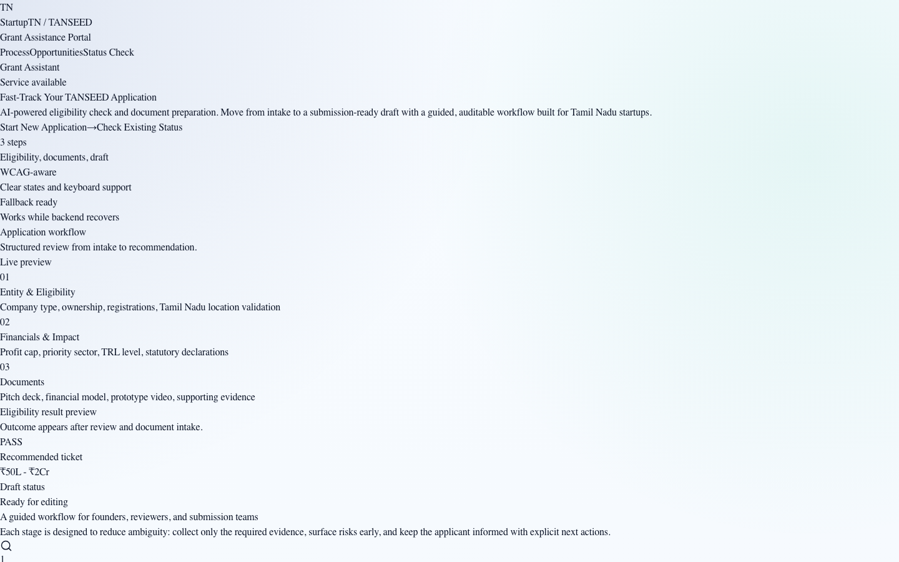
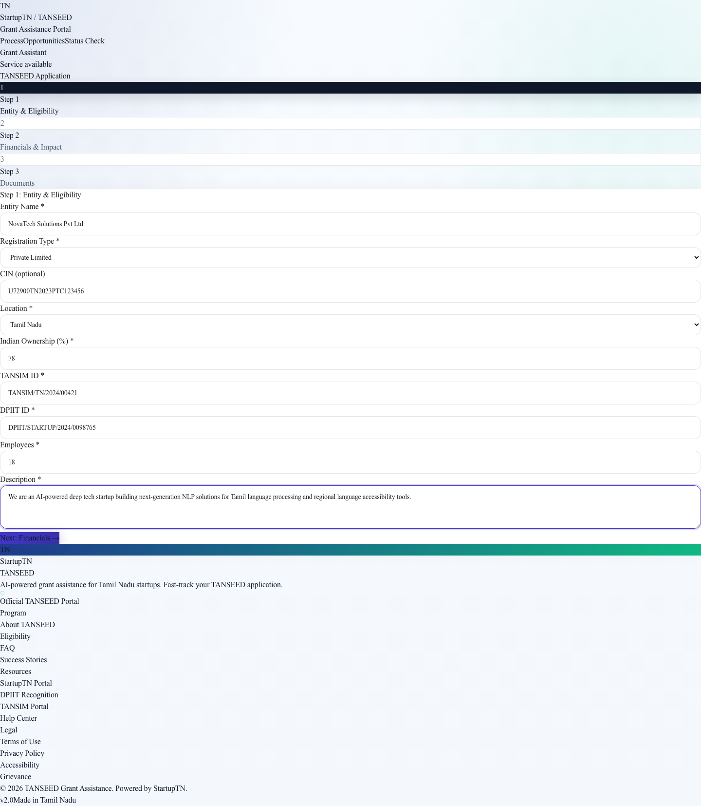
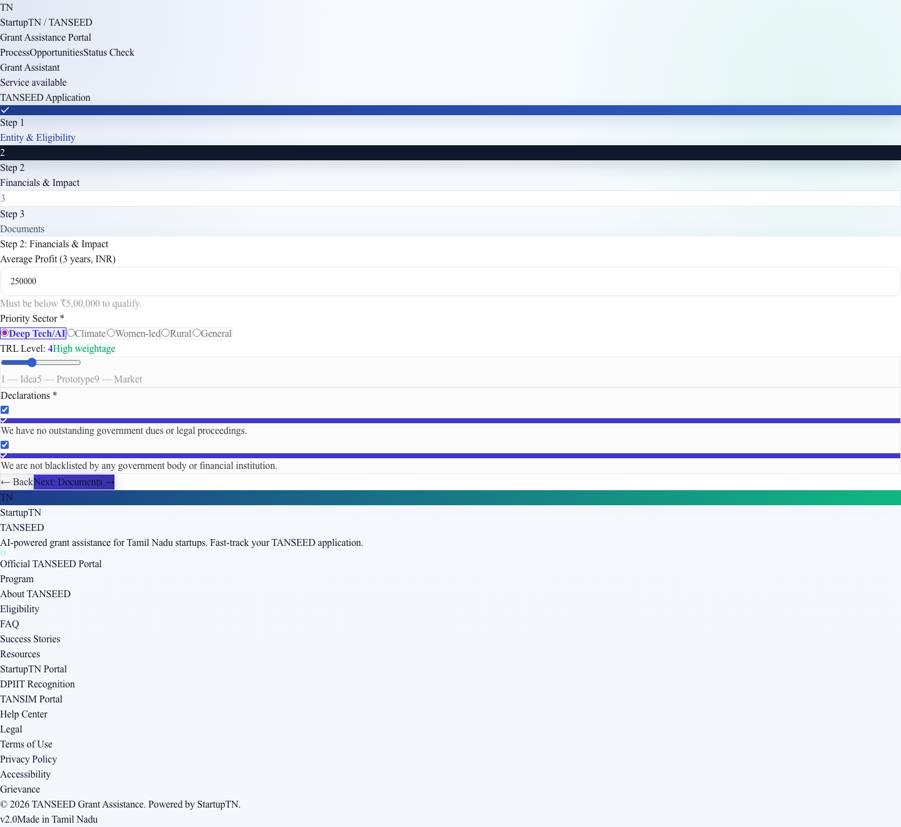
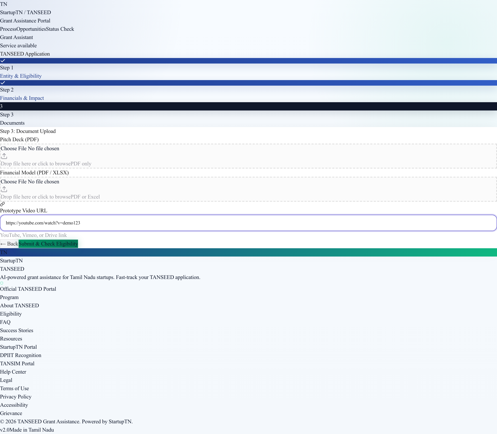
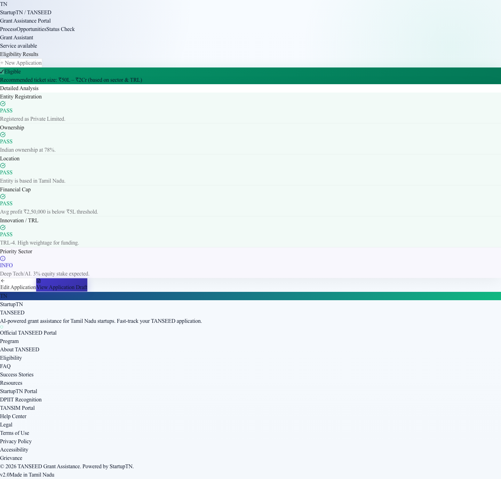
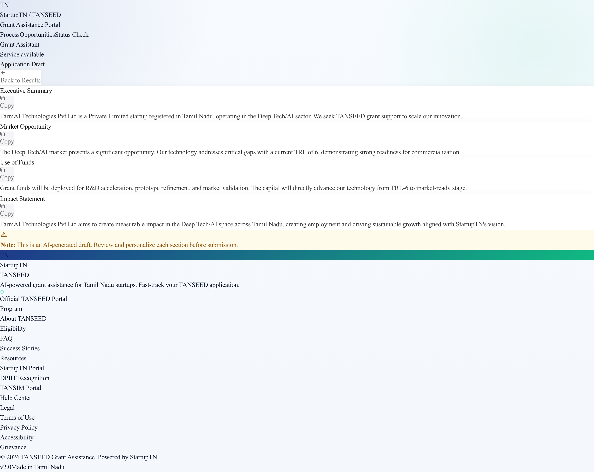
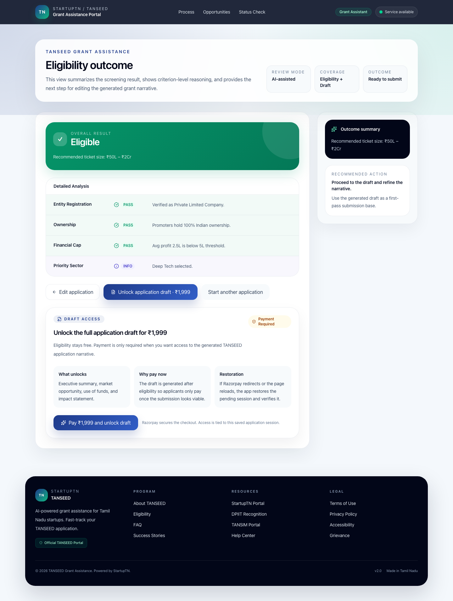

# TANSEED TNAA — AI-Powered Grant Eligibility Platform

[](https://www.typescriptlang.org/)
[](https://react.dev/)
[](https://python.org)
[](https://fastapi.tiangolo.com/)
[](https://tailwindcss.com/)
[](https://www.trychroma.com/)
[](LICENSE)

An intelligent application platform for Tamil Nadu's **TANSEED** (Tamil Nadu Startup Seed Grant Fund) — the state's flagship seed fund initiative for early-stage startups. Built with FastAPI, ChromaDB RAG, and a premium Apple-inspired React frontend.

> **TANSEED** provides early-stage startups in Tamil Nadu with seed funding of up to ₹2 Cr. This platform streamlines the application process with AI-powered eligibility checking and draft generation.

## Screenshots

| Landing Page | Step 1: Entity & Eligibility |
|:---:|:---:|
|  |  |

| Step 2: Financials & Impact | Step 3: Document Upload |
|:---:|:---:|
|  |  |

| Eligibility Results | Application Draft |
|:---:|:---:|
|  |  |

| Draft Payment Gate |
|:---:|
|  |

## Features

- **Multi-step application flow** — Guided intake from entity details through document upload with real-time validation
- **AI-powered eligibility check** — RAG-grounded evaluation against official TANSEED criteria using ChromaDB vector search
- **Smart fallback engine** — Works offline with rule-based checking when the RAG pipeline is unavailable
- **Application draft generation** — AI-assisted draft with executive summary, market opportunity, use of funds, and impact statement
- **Apple-inspired design** — Glassmorphism surfaces, rich animations, responsive layout across all devices
- **Keyboard accessible** — WCAG-aware form controls with clear state indicators and screen reader support
- **Local fallback logic** — Runs fully offline for initial demos; no backend dependency required for the frontend to function

## Architecture

```
┌─────────────────────────────────────────────────────────────┐
│                    Frontend (React 19 + Vite)                │
│  ┌──────────┐  ┌──────────┐  ┌──────────┐  ┌────────────┐ │
│  │ Landing  │→ │ Step 1-3 │→ │ Results  │→ │ Draft View │ │
│  │  Page    │  │  Forms   │  │ Dashboard│  │            │ │
│  └──────────┘  └──────────┘  └──────────┘  └────────────┘ │
│         ↓              ↓              ↓              ↓      │
│  ┌──────────────────────────────────────────────────────────┐│
│  │            API Client (with local fallback)              ││
│  └──────────────────────────────────────────────────────────┘│
└─────────────────────────────────────────────────────────────┘
                              │
                    HTTP (REST API)
                              │
┌─────────────────────────────────────────────────────────────┐
│                     Backend (FastAPI)                        │
│  ┌──────────────────┐  ┌──────────────────────────────────┐ │
│  │  Eligibility     │  │  Draft Generator                 │ │
│  │  Engine          │  │  (LLM + template based)          │ │
│  └──────────────────┘  └──────────────────────────────────┘ │
│              │                        │                     │
│              ▼                        ▼                     │
│  ┌──────────────────────────────────────────────────────────┐│
│  │          ChromaDB Vector Store (RAG)                     ││
│  │          + LangChain Pipeline                            ││
│  └──────────────────────────────────────────────────────────┘│
└─────────────────────────────────────────────────────────────┘
```

## Tech Stack

| Layer | Technology |
|---|---|
| **Frontend** | React 19, TypeScript, Tailwind CSS v4, Vite 8, Lucide Icons |
| **Backend** | Python 3.12+, FastAPI, ChromaDB, LangChain |
| **Testing** | Vitest + Playwright (frontend), pytest (backend) |
| **Design** | Apple HIG-inspired, glassmorphism, 8px grid system |
| **RAG Pipeline** | LangChain-powered retrieval over official TANSEED guidelines documents |

## Quick Start

### Prerequisites

- **Node.js** 20+ and npm
- **Python** 3.12+ (for backend)
- **Git**

### Backend

```bash
cd backend
python -m venv .venv
source .venv/bin/activate
pip install -r requirements.txt
uvicorn main:app --reload
```

The API server will start at `http://localhost:8000`.

### Frontend

```bash
cd frontend
npm install
npm run dev
```

Open `http://localhost:5173` in your browser.

### Run with Docker (Coming Soon)

```bash
docker-compose up
```

## Project Structure

```
tanseed-tnaa/
├── frontend/            # React 19 + Vite + TypeScript
│   ├── src/
│   │   ├── components/  # UI components (Hero, Forms, Dashboard, etc.)
│   │   ├── context/     # React context for application state
│   │   ├── api.ts       # API client with local fallback
│   │   └── types.ts     # TypeScript type definitions
│   └── ...
├── backend/             # FastAPI + ChromaDB
│   ├── main.py          # API entry point
│   └── ...
├── screenshots/         # Application screenshots
└── README.md
```

## API Endpoints

| Endpoint | Method | Description |
|---|---|---|
| `/health` | GET | Liveness probe |
| `/eligibility` | POST | Check TANSEED eligibility (RAG-grounded) |
| `/draft` | POST | Generate AI-assisted application draft |
| `/ingest` | POST | Re-ingest TANSEED guidelines into vector store |

See [backend/README.md](backend/README.md) for full API documentation.

## Use Case

This platform is designed for:

- **Tamil Nadu startups** applying for TANSEED seed grant funding
- **Incubation centers** assisting startups with grant applications
- **Government evaluators** reviewing eligibility and application drafts
- **Developers** looking to integrate RAG-powered eligibility engines into their applications

## Contributing

Contributions are welcome! Please feel free to submit a Pull Request.

1. Fork the repository
2. Create your feature branch (`git checkout -b feature/amazing-feature`)
3. Commit your changes (`git commit -m 'Add amazing feature'`)
4. Push to the branch (`git push origin feature/amazing-feature`)
5. Open a Pull Request

## License

This project is licensed under the MIT License. See `LICENSE` file for details.

## Acknowledgments

- [Tamil Nadu Startup & Innovation Mission](https://startup.tn.gov.in/) — TANSEED Grant Program
- Built with [LangChain](https://www.langchain.com/) and [ChromaDB](https://www.trychroma.com/)
- Inspired by Apple Human Interface Guidelines
